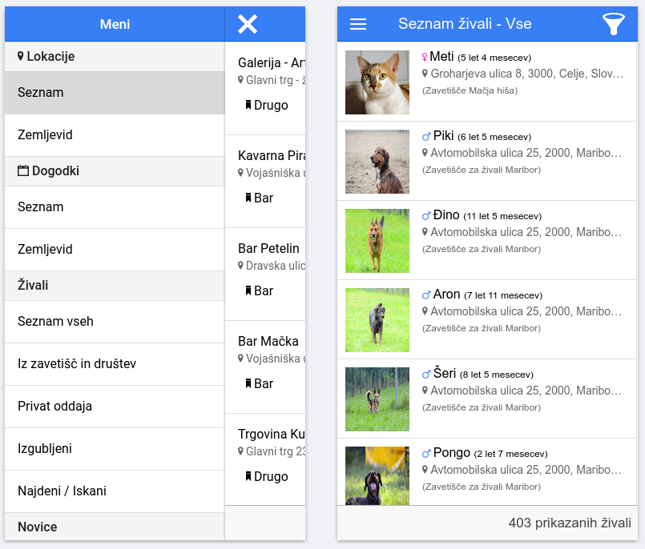
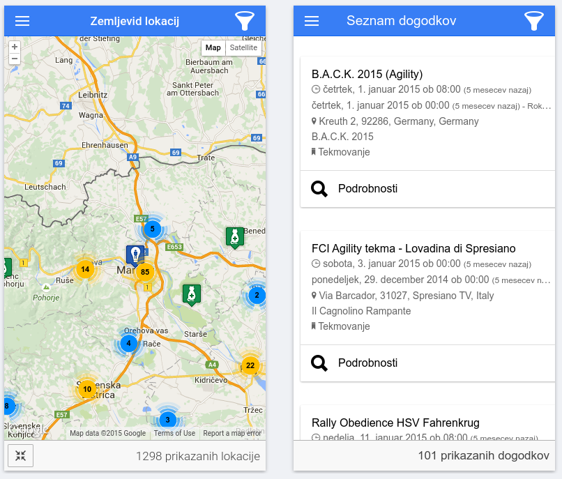
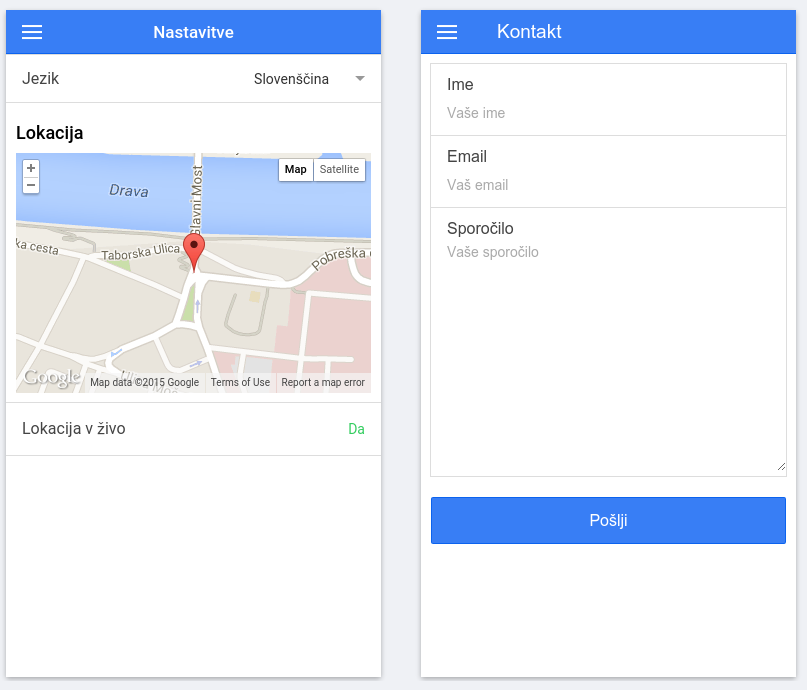

README
======
**Doggie - Mobile**

Doggie is an web and mobile application for all dog owners, where you will be able to find places (hotels, restaurants, nannies, shops, and more) for you and your furry friends.

Build with [Ionic](http://ionicframework.com/).

## Getting started
* `npm install ionic cordova` (if you haven't already)
* `git clone https://github.com/bobalazek/doggie-mobile && cd _$`
* `ionic serve`
* Done!

Preview
----------------

### Menu and Animals ###

### Map and Events ###

### Settings and Contact ###

FAQ
----------------
### No tests and / or automated workflow (besides basic ionic tasks)? 
Yes, I know, I know. I was too much concentrated with rapid development, so I just skipped it. I will do them ASAP. I promise!

### What's that language?
It's Slovenian, but don't worry, it can be translated in any language you want. I've primary translated only Slovenian, because that was also the target audience. Locales can be found in [www/locales/](https://github.com/bobalazek/doggie-mobile/tree/master/www/locales).

## License ##
Doggie (Mobile) is licensed under the MIT license.
